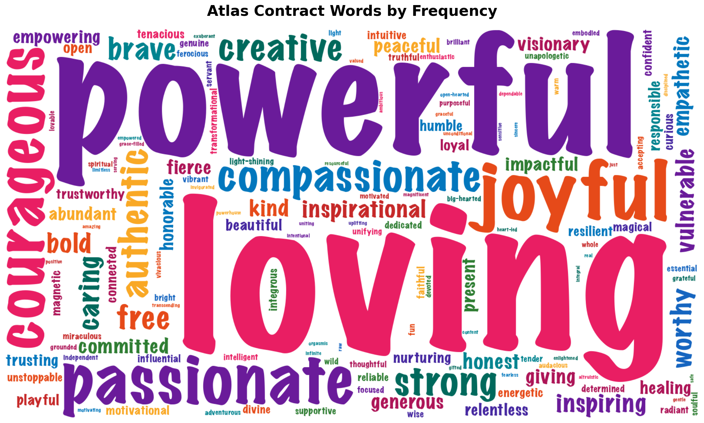
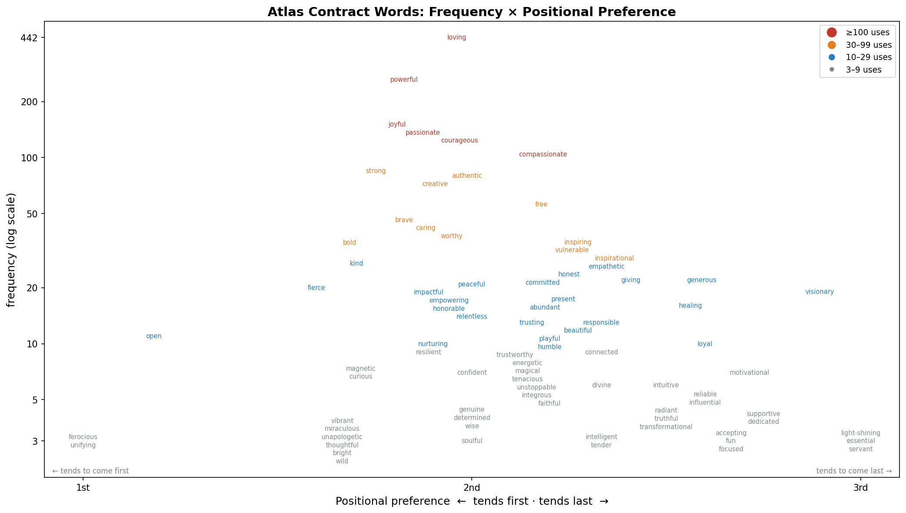

# Atlas Contract Statistics

## Data

The dataset consists of 819 contracts across 20 cohorts, collected from various sources. Altogether, it comprises 140 unique adjectives, with 2,459 adjectives in total (counting duplicates).

The anonymized dataset is available in [this repository](https://github.com/aaron1729/atlas-contracts) for further play.
- The raw contracts are available in [`contracts_raw.jsonl`](contracts_raw.jsonl). These have been parsed but not otherwise modified.
- The cleaned contracts are available in [`contracts_clean.jsonl`](contracts_clean.jsonl), which accounts for
    - standardizing spellings,
    - fixing a number of misspellings,
    - rewriting a few cute alternative spellings (e.g. "trans4mational" for "transformational" and "greatful" for "grateful"),
    - translating one contract from Spanish to English.

Here are two illustrative visualizations. The remaining sections record a number of interesting statistics.

---

## Probability of a shared contract

Taking the empirical distribution as a stand-in for the true distribution:

> **P(two randomly chosen participants have the exact same contract) ≈ 0.23%**

The most common contract — *(loving, joyful, powerful)* — has been independently chosen by **8 different people**.

If the three words were drawn independently from the marginal word distribution, the contract *(joyful, loving, free)* would arise with probability **~0.026%** (~1 in 3,900). The probability that two specific people both land on it is **~1 in 15 million**!!

---

## Positional tendencies

Words are not placed randomly across the three slots:

| Slot | Over-represented words |
|------|----------------------|
| **1st** | open (2.5×), fierce, strong, impactful, bold — *active / intensity words* |
| **2nd** | nurturing (2.1×), empowering (1.8×), compassionate, kind, honorable — *relational words* |
| **3rd** | visionary (2.7×), loyal, healing (both 2.1×), generous (2.0×) — *aspirational / outcome words* |

The structure suggests an unconscious ordering: **how I show up → how I relate → who I'm becoming**.

---

## Co-occurrence: words that attract each other

Some word pairs appear together far more often than their individual frequencies predict:

| Pair | Lift vs. chance | Appearances |
|------|----------------|-------------|
| confident + motivational | 83× more likely | 5 |
| ferocious + nurturing | 82× more likely | 3 |
| bold + confident | 17× more likely | 5 |
| bold + motivational | 17× more likely | 5 |
| committed + visionary | 8× more likely | 4 |

The *bold / confident / motivational* cluster is a striking archetype — three individually rare words that repeatedly appear together.

---

## Anti-correlation: words that repel each other

Among common words, some pairs appear together far less often than expected — likely because participants treat them as alternatives rather than complements:

| Pair | Lift vs. chance | Appearances |
|------|----------------|-------------|
| brave + powerful | 0.27× (−73%) | 4 |
| courageous + strong | 0.31× (−69%) | 4 |
| passionate + strong | 0.36× (−64%) | 5 |
| compassionate + powerful | 0.42× (−58%) | 14 |

The *strength* family (brave, powerful, courageous, strong) and the *warmth* family (compassionate, loving, caring) tend not to cross — people draw from one pool or the other.

---

## Five further tidbits

**1. Contract twins** — 48.5% of participants share their exact contract with at least one other person. 420 contracts are completely unique; 1 contract is shared by 8 people.

**2. Sworn enemies** — *compassionate* (104 appearances) and *passionate* (135 appearances) have **never appeared in the same contract**, whereas random chance (and the assumption that words are uncorrelated) would predict ~17 co-occurrences. They apparently feel redundant even though they mean different things. Other notable never-pairs: *joyful + worthy*, *empathetic + joyful*.

**3. Vocabulary concentration** — Just 7 words account for 50% of all word appearances. The top 5 (*loving, powerful, joyful, passionate, courageous*) fill 45.6% of all slots. At the other extreme, **39 words have been chosen by exactly one person ever**, including: *heart-led, grace-filled, raw, orgasmic, altruistic, exuberant, powerhouse, transcending*.

**4. Identity clusters** — Some contracts appear thousands of times more often than independence predicts, suggesting genuine shared archetypes: *(bold, confident, motivational)* appears 5 times at 52,000× the independent probability; *(ferocious, nurturing, compassionate)* appears 3 times at 17,200×; *(passionate, committed, visionary)* appears 4 times at 1,300×.

**5. *Loving* as universal connector** — *Loving* appears in 54% of all contracts and co-occurs with **96 different words** — virtually the entire vocabulary. The next most connected word, *powerful*, pairs with 72. By contrast, *trusting*, *healing*, *nurturing*, and *playful* each pair with only 10–11 unique words, suggesting they belong to tight, specific identity clusters.

---

## Top 10 most common adjectives overall

| Rank | Word | Count |
|:----:|------|------:|
| 1 | loving | 442 |
| 2 | powerful | 263 |
| 3 | joyful | 151 |
| 4 | passionate | 135 |
| 5 | courageous | 125 |
| 6 | compassionate | 104 |
| 7 | strong | 85 |
| 8 | authentic | 78 |
| 9 | creative | 74 |
| 10 | free | 56 |

---

## Top 5 adjectives per cohort

Here are the top 5 adjectives in each cohort. (Here and below, we restrict to those cohorts whose entire roster of players and their contracts are included in the dataset.)

| Cohort | Players | Top 5 words |
|--------|:-------:|-------------|
| LAS7 | 47 | loving (29), powerful (19), joyful (9), caring (8), passionate (6) |
| LAS8 | 30 | loving (18), strong (7), authentic (6), powerful (5), caring (4) |
| LAS10 | 21 | loving (15), joyful (5), compassionate (4), creative (4), authentic (4) |
| LAS11 | 27 | loving (12), powerful (10), courageous (5), strong (4), inspiring (4) |
| LAS12 | 17 | powerful (8), loving (7), joyful (5), beautiful (3), strong (3) |
| ATX10 | 46 | loving (23), powerful (16), passionate (11), joyful (8), strong (6) |
| ATX11 | 23 | loving (15), powerful (9), joyful (8), courageous (5), worthy (4) |
| ATX12 | 16 | loving (10), passionate (4), powerful (4), strong (3), brave (3) |
| ATX13 | 21 | loving (12), powerful (6), courageous (6), compassionate (4), creative (3) |
| ATX14 | 20 | loving (8), powerful (6), joyful (4), trustworthy (3), free (3) |
| ATX15 | 29 | powerful (15), loving (10), joyful (7), passionate (6), authentic (5) |
| ATX16 | 25 | loving (13), powerful (7), joyful (7), courageous (6), creative (4) |

*Loving* is the top word in 10 of these 12 cohorts. LAS12 and ATX15 are the exceptions, both led by *powerful*.

---

## Most unique and most prototypical contract per cohort

Uniqueness is estimated using the independence model (P = product of individual word frequencies). The most unique player has the contract least likely to arise by chance; the most prototypical has the contract most consistent with the overall distribution.

| Cohort | Most unique (lowest P) | Most prototypical (highest P) |
|--------|----------------------|-------------------------------|
| LAS7 | worthy, caring, accepting | loving, joyful, powerful |
| LAS8 | fierce, responsible, committed | loving, compassionate, courageous |
| LAS10 | courageous, loyal, dedicated | joyful, loving, passionate |
| LAS11 | humble, gifted, faithful | powerful, courageous, loving |
| LAS12 | honest, joyful, servant | creative, loving, powerful |
| ATX10 | magnetic, dedicated, resilient | loving, joyful, powerful |
| ATX11 | healing, bright, worthy | loving, joyful, powerful |
| ATX12 | inspiring, spiritual, wise | powerful, strong, loving |
| ATX13 | honorable, integrous, responsible | loving, powerful, courageous |
| ATX14 | reliable, trustworthy, servant | courageous, loving, powerful |
| ATX15 | unapologetic, authentic, visionary | loving, powerful, joyful |
| ATX16 | thoughtful, magical, creative | joyful, loving, strong |

---

## Most unique and most prototypical contract overall

The most prototypical contract in the full dataset is ***(loving, powerful, joyful)***, which also happens to be the most common contract (8 appearances). The most unique contract overall is ***(open, amazing, unconditional)***, combining three rare words to produce the lowest estimated probability of any contract in the data.